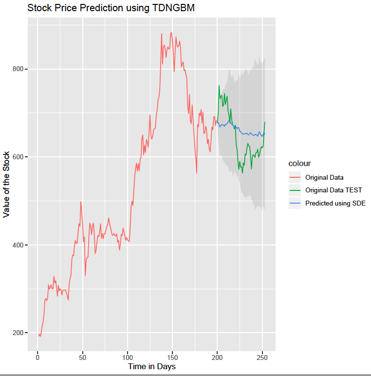

# Stock Market Forecasting Exercise
#### Shalin Shah
The R code in this repository is an exercise in forecasting using one year of stock price data for three companies (TSLA, MSFT, TGT).
  
The data in the data folder contains one year of stock prices (downloaded from Yahoo finance) of each of the three stocks (2020-06-24 to 2021-06-24).  
The first 199 days are used as training data and the last 54 days are used as a test set for prediction.  
The code is used in the paper "Comparison of Stochastic Forecasting Models" which can be <a href="https://doi.org/10.31219/osf.io/7fepu">found here</a>.  
<b>Cite this code:</b>
<pre>
@misc{shah2021forecast,
  title={Comparison of Stochastic Forecasting Models},
  author={Shah, Shalin},
  year={2021}
}
</pre> 
There are five algorithms in the five R scripts: 
<ol>
  <li>tdngbm: Geometric Brownian motion with time dependent and non-linear terms (stochastic differential equation)</li>
  <li>gbm: Geometric Brownian motion (stochastic differential equation)</li>
  <li>ARIMA: Auto-regressive integrated moving average</li>
  <li>Bayesian Filter</li>
  <li>Kalman Filter</li>
</ol>
 

 
The stochastic differential equations are very sensitive to initial values (currently all 8 parameters are initialized to 0.01). If the confidence intervals appear too wide or if you see NaNs in the output, try any of the following:
  
<ul>
<li>Try pmle="shoji" in fitsde (or try other methods for MLE)</li>
<li>Try to get more data</li>
<li>Shorten the time horizon</li>
<li>Change the initial values</li>
<li>Consider working in log space</li>
</ul>
The Bayesian filter was adapted from an implementation in [10] 
<h3>References</h3>
[1] Bernt Oksendal. Stochastic differential equations: an introduction with applications. Springer Science & Business Media, 2013.  
[2] Mohammad Rafiqul Islam and Nguyet Nguyen. Comparison of financial models for stock price prediction. Journal of Risk and Financial Management, 13(8):181, 2020.  
[3] Harold Edwin Hurst. Long-term storage capacity of reservoirs. Transactions of the American society of civil engineers, 116(1):770–799, 1951.  
[4] Sheldon M Ross. Introduction to probability models. Academic press, 2014.  
[5] R Straja Sorin. Stochastic modeling of stock prices. Mongometry investment technology Inc, 200:1–19.  
[6] Mike West and Jeff Harrison. Bayesian forecasting and dynamic models. Springer Science & Business Media, 2006.  
[7] Simo S rkk . Bayesian filtering and smoothing. Number 3. Cambridge University Press, 2013.  
[8] Rudolph Emil Kalman. A new approach to linear filtering and prediction problems. 1960.  
[9] Wei Zhu. Bayesian inference for the normal distribution.  
[10] Learning Machines. Kalman filter as a form of bayesian updating (<a href="https://www.r-bloggers.com/2020/07/kalman-filter-as-a-form-of-bayesian-updating/">See here</a>).  
[11] Roger Labbe. Kalman and bayesian filters in python. Chap, 7(246):4, 2014.  
[12] George EP Box, Gwilym M Jenkins, Gregory C Reinsel, and Greta M Ljung. Time series analysis: forecasting and control. John Wiley & Sons, 2015.  
[13] Peter C Young. Recursive estimation and time-series analysis: An introduction for the student and practitioner. Springer Science & Business Media, 2011.  
[14] Peter C Young, Diego J Pedregal, and Wlodek Tych. Dynamic harmonic regression. Journal of forecasting, 18(6):369–394, 1999.  
[15] Peter C Young, C James Taylor, Wlodek Tych, DJ Pedregal, and Paul G McKenna. The captain toolbox. 2010.  
[16] Peter C Young, Wlodzimierz Tych, and C James Taylor. The captain toolbox for matlab. IFAC Proceedings Volumes, 42(10):758–763, 2009.  
