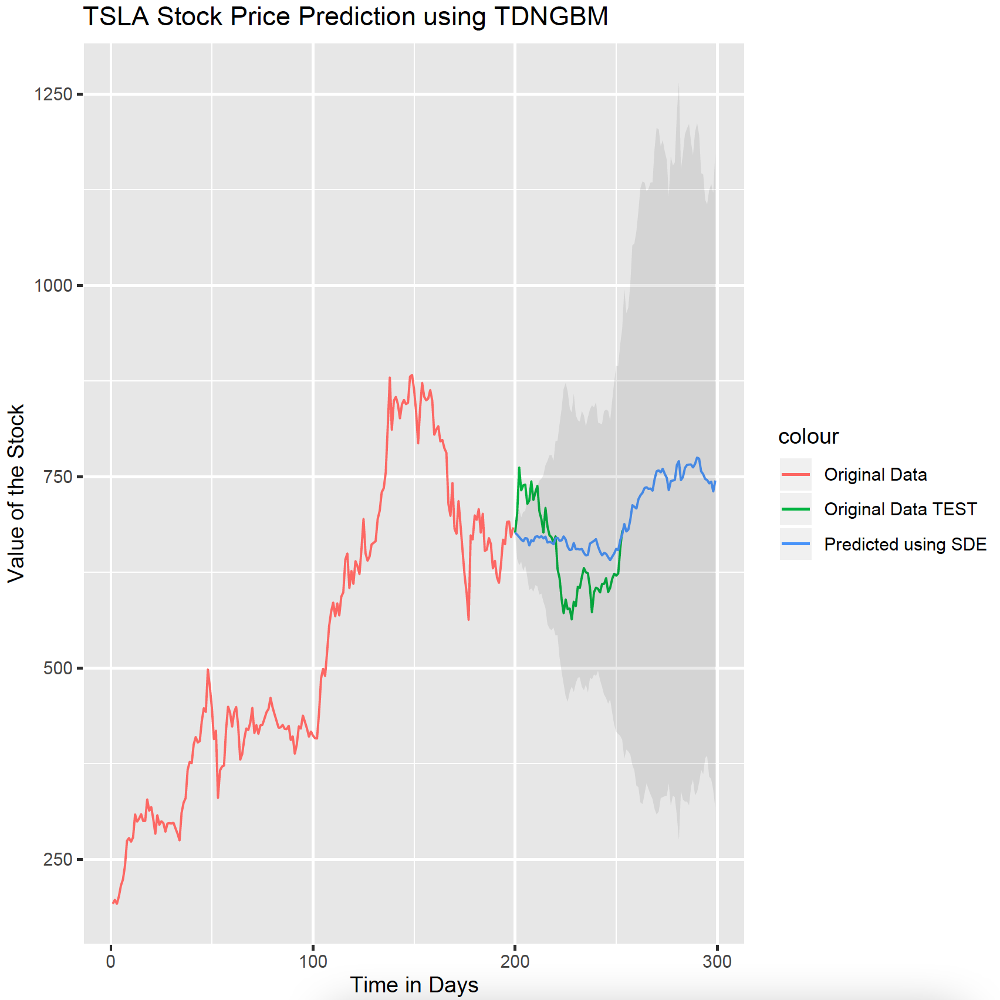

# Stock Market Forecasting Exercise
#### Shalin Shah
The R code in this repository is an exercise in forecasting using one year of stock price data for four companies (TSLA, MSFT, TGT, WMT).
  
The data in the data folder contains one year of stock prices (downloaded from Yahoo finance) of each of the four stocks (2020-06-24 to 2021-06-24).  
The first 199 days are used as training data and the last 54 days are used as a test set for prediction.  
The code is used in the paper "Comparison of Stochastic Forecasting Models" which will be uploaded soon.  
<b>Cite this code:</b>
<pre>
@misc{shah2021gforecast,
  title={Comparison of Stochastic Forecasting Models},
  author={Shah, Shalin},
  year={2021}
}
</pre> 
There are five algorithms in the five R scripts: 
<ol>
  <li>tdngbm: Geometric Brownian motion with time dependent and non-linear terms (stochastic differential equation)</li>
  <li>gbm: Geometric Brownian motion (stochastic differential equation)</li>
  <li>ARIMA: Auto-regressive integrated moving average</li>
  <li>Bayesian Filter</li>
  <li>Kalman Filter</li>
</ol>
 

